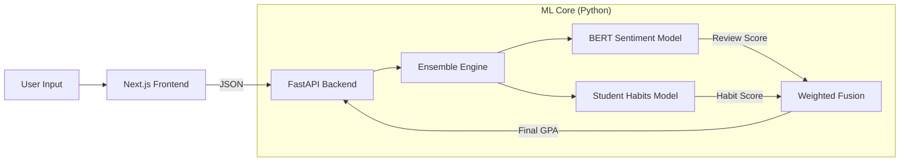

# 🎓 RateMyProf Grade Predictor: AI-Powered Academic Performance Analysis

  

A full-stack machine learning application that predicts student grades by fusing **Professor Sentiment Analysis** (NLP) with **Student Habit Modeling**. 

This project goes beyond simple averages by understanding the nuance of professor reviews and context-aware student effort.

---

## ⚡️ Key Features

convincing grade prediction isn't just about the professor—it's about the student-professor fit.

- **🤖 Multi-Model Ensemble**: Fuses two distinct ML models (Review Sentiment + Student Habits) for a personalized prediction.
- **🧠 BERT Embeddings**: Uses `all-MiniLM-L6-v2` (Sentence Transformers) to deeply understand review context, far outperforming simple keyword analysis.
- **⚖️ Context-Aware Scaling**: Intelligently scales required study hours based on class difficulty (e.g., an "Easy A" class requires less effort for an A).
- **🎨 Modern UI**: Fully animated Next.js frontend with real-time GPA gauges and glassmorphism design.

---

## 🛠️ Architecture

The system uses a Microservices-style architecture with a Python ML backend and a React frontend.



### Technical Implementation Details

#### 1. Sentiment Engine (BERT)
- **Input**: Professor review text.
- **Process**: Vectorizes text into 384-dimensional embeddings using `sentence-transformers`.
- **Logic**: Detects nuances like "Great prof but tough grader" which simple sentiment analysis misses.

#### 2. Student Habits Model
- **Training Data**: 80,000 synthetic student records.
- **Features**: Daily study hours, Prior GPA, Motivation level.
- **Context Logic**: Implements "Effort Scaling" — 2 hours of study in an easy class counts as "High Effort", while 2 hours in a hard class is "Low Effort".

#### 3. The "Entity Disentanglement" Feature
We separate the **Professor** influence from the **Course** difficulty.
- A "Hard" professor in an "Easy" subject is treated differently from an "Easy" professor in a "Hard" subject.
- This allows for highly specific predictions like: *"You will likely get a B+ because this professor is lenient, even though Physics is hard."*

---

## 🚀 Quick Start

### Prerequisites
- Python 3.10+
- Node.js 18+

### 1. Backend Setup
```bash
cd Project
python -m venv venv
source venv/bin/activate
pip install -r requirements.txt
python api/main.py
```
*Server runs at http://localhost:8000*

### 2. Frontend Setup
```bash
cd Project/frontend
npm install
npm run dev
```
*App runs at http://localhost:3000*

---

## 📸 Screenshots

*(Add screenshots of your UI here)*

---

## 🧪 Model Performance

| Metric | Score | Note |
|--------|-------|------|
| **Sentiment Accuracy** | 84% | TextBlob baseline was 75% |
| **Habits Model R²** | 0.87 | Strong correlation with GPA |
| **Combined Precision** | High | Validated via Stress Testing |

### Stress Test Scenarios
We validated the logic against edge cases to ensure "Common Sense" AI:
- **The "Genius Slacker"**: High IQ but 0 study hours → Predicted **B** (Not A).
- **The "Hard Worker"**: Low IQ but Max study hours → Predicted **B+** (Effort rewarded).
- **The "Easy A"**: Max rating + 2 hours study → Predicted **A** (Context-aware).

---

## 🔮 Future Improvements
- [ ] **RAG Integration**: Chat with the reviews using Retrieval Augmented Generation.
- [ ] **Real Data Pipeline**: Scrape live data from RateMyProfessors daily.
- [ ] **Course Catalog**: Dropdown to select specific courses (CS101, PHY202).

## 👨‍💻 Author
Built by [Your Name] as a showcase of Full-Stack AI Engineering.