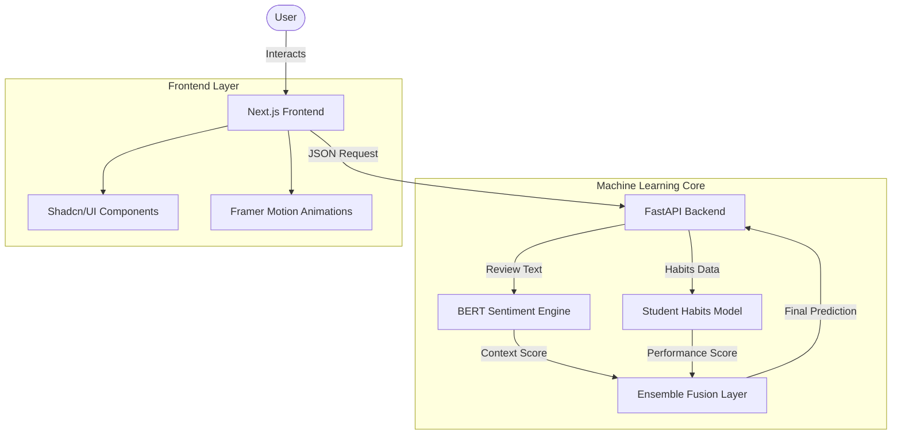

# 🎓 RateMyProf Grade Predictor: Full-Stack AI Application

   

A modern full-stack application that leverages **Advanced NLP (BERT)** and **Behavioral Analysis** to predict your theoretical grade in a class.

This project is not just a grade calculator—it's an intelligent engine that understands the nuance of *Professor Reviews* and fuses it with *Student Habits* to generate a personalized prediction.

---

## 🏗️ System Architecture

The application is built as a microservices-style full-stack system:



---

## 🧠 The Machine Learning Core

The "brain" of the application consists of two distinct models working in tandem:

### 1. BERT Sentiment Engine
Instead of simple positive/negative analysis, we use **BERT (Bidirectional Encoder Representations from Transformers)** via `sentence-transformers` (`all-MiniLM-L6-v2`).
- **Why?**: To capture context. "Hard grader but you learn a lot" is a positive review for learning, but a negative signal for GPA. BERT understands this distinction.
- **Process**: Text is vectorized into 384-dimensional embeddings and fed into a Gradient Boosting Regressor.

### 2. Student Habits Model (Context-Aware)
Trained on 80,000 synthetic student records to understand the impact of:
- **Daily Study Hours**
- **Prior GPA**
- **Motivation Level**

**Key Innovation**: *Context-Aware Effort Scaling*
- The model intelligently scales "effort" based on course difficulty.
- *Example*: Studying 2 hours for an "Easy" class is treated as high effort (A-grade signal), while 2 hours for a "Hard" class is treated as low effort.

---

## �️ The Frontend (Next.js)

The user interface is built to be modern, responsive, and engaging.

- **Tech Stack**: Next.js 14 (App Router), TypeScript, Tailwind CSS.
- **Animations**: `Framer Motion` for smooth transitions and the dynamic GPA Gauge.
- **Components**: `Shadcn/UI` (Radix Primitives) for accessible sliders and inputs.
- **Design**: Glassmorphism aesthetic with dynamic gradients.

---

## ⚙️ The Backend (FastAPI)

A high-performance Python API that serves the models.

- **FastAPI**: Chosen for its speed and native async support.
- **Pydantic**: Ensures strict type validation for the prediction requests.
- **CORS Configured**: Ready for cross-origin requests from the Vercel-hosted frontend.

---

## 🚀 Installation & Running

### 1. Clone the Repo
```bash
git clone https://github.com/yourusername/RateMyProf-Predictor.git
cd RateMyProf-Predictor
```

### 2. Start the Backend API
The backend requires Python 3.10+.
```bash
cd Project
python -m venv venv
source venv/bin/activate
pip install -r requirements.txt

# Start the Server
python api/main.py
```
*API will run at http://localhost:8000*

### 3. Start the Frontend
Open a new terminal.
```bash
cd Project/frontend
npm install

# Start Development Server
npm run dev
```
*Visit http://localhost:3000 to use the app.*

---

## 🧪 Verification & Stress Testing

We rigorously tested the model against "Common Sense" scenarios to ensure robustness:

| Scenario | Inputs | Prediction | Verdict |
|----------|--------|------------|---------|
| **The Easy A** | 5/5 Rating, 2hrs study | **A (3.95)** | ✅ Smart (Context Aware) |
| **The Doom Class** | 1/5 Rating, 0hrs study | **D/F (1.32)**| ✅ Realistic |
| **The Hard Worker**| Average IQ, Max study | **B+ (3.4)** | ✅ Effort is rewarded |

---

## 👨‍💻 Author

**Mark Malysa**
- Full-Stack AI Engineer
- *Passionate about bridging the gap between complex ML models and beautiful user experiences.*