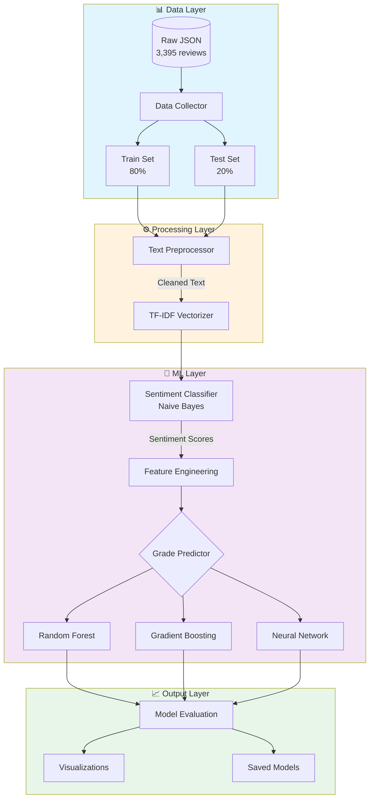
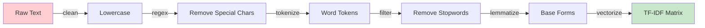
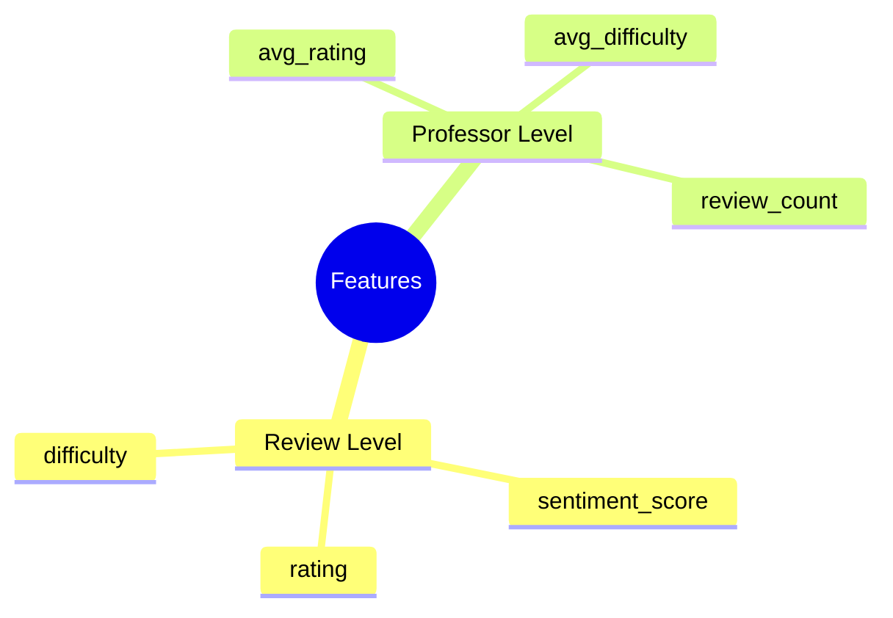

<div align="center">

# 🎓 RateMyProfessor Sentiment Analysis & Grade Prediction

**An end-to-end ML pipeline combining NLP sentiment analysis with predictive modeling**

[](https://python.org)
[](https://scikit-learn.org)
[](https://pandas.pydata.org)
[](https://nltk.org)

[Overview](#-overview) • [Architecture](#-architecture) • [Results](#-results) • [Quick Start](#-quick-start) • [Key Learnings](#-key-learnings)

</div>

---

## 📌 Overview

This project explores a fundamental question in educational data mining:

> **Can we predict student grades from the sentiment and content of professor reviews?**

I built a **two-stage supervised learning pipeline** that:
1. **Classifies sentiment** from review text using NLP techniques
2. **Predicts grade outcomes** using ensemble regression models

The project processes **3,395 real professor reviews** and implements **three different ML approaches** for comparative analysis.

### 🎯 Key Technical Highlights

| Skill Area | Implementation |
|------------|----------------|
| **NLP Pipeline** | Text preprocessing, TF-IDF vectorization, sentiment classification |
| **ML Engineering** | Feature engineering, model training, hyperparameter configuration |
| **Data Engineering** | ETL pipeline, train/test splitting, data validation |
| **Software Design** | Modular architecture, OOP patterns, logging & error handling |
| **Experimentation** | A/B model comparison, metrics evaluation, result visualization |

---

## 🏗 Architecture

### System Design



### Pipeline Stages



---

## 📂 Project Structure

```
RateMyProf_Sentiment_Analysis_to_Grade_Prediction/
│
├── Project/
│   ├── main.py                    # Random Forest pipeline
│   ├── main_gb.py                 # Gradient Boosting pipeline
│   ├── main_nn.py                 # Neural Network pipeline
│   │
│   ├── src/
│   │   ├── data/
│   │   │   ├── data_collection.py     # ETL & data splitting
│   │   │   └── preprocessing.py       # NLP text processing
│   │   ├── models/
│   │   │   ├── sentiment_analysis.py      # Naive Bayes classifier
│   │   │   ├── predictive_modeling.py     # Random Forest regressor
│   │   │   ├── predictive_modeling_gb.py  # Gradient Boosting regressor
│   │   │   └── predictive_modeling_nn.py  # MLP Neural Network
│   │   └── visualization/
│   │       └── visualization.py       # Plotting & analysis
│   │
│   ├── data/
│   │   ├── raw/                   # Train/test CSVs
│   │   └── processed/             # Cleaned datasets
│   │
│   ├── models/                    # Serialized model artifacts
│   ├── visualizations/            # Generated plots
│   └── requirements.txt
│
└── README.md
```

---

## 🔬 Technical Implementation

### Stage 1: Sentiment Classification

**Objective:** Classify review sentiment as positive or negative

| Component | Choice | Rationale |
|-----------|--------|-----------|
| **Vectorization** | TF-IDF (5,000 features) | Captures term importance while reducing dimensionality |
| **Classifier** | Multinomial Naive Bayes | Fast training, works well with sparse text data |
| **Labels** | Binary (rating ≥ 3.5 → positive) | Clear threshold for sentiment polarity |

```python
# Simplified pipeline example
vectorizer = TfidfVectorizer(max_features=5000)
X = vectorizer.fit_transform(cleaned_reviews)
model = MultinomialNB()
model.fit(X_train, y_train)
```

### Stage 2: Grade Prediction

**Objective:** Predict numerical grade (0.0-4.0 GPA scale) from features

| Model | Algorithm | Configuration |
|-------|-----------|---------------|
| **Random Forest** | Parallel ensemble | 100 trees, default depth |
| **Gradient Boosting** | Sequential ensemble | 100 estimators, learning rate optimization |
| **Neural Network** | MLP Regressor | 2 hidden layers (64 → 32 neurons) |

### Feature Engineering



---

## 📊 Results

### Sentiment Classification Performance

| Metric | Training | Test |
|--------|----------|------|
| **Accuracy** | 73.7% | **80.0%** |
| **F1 Score** | 84.5% | **88.8%** |
| **Precision** | 78.2% | 85.3% |
| **Recall** | 92.1% | 92.7% |

> ✅ **Strong performance** — The sentiment model generalizes well to unseen data, with the test set actually outperforming training (indicating good regularization).

### Grade Prediction Performance

| Model | Train RMSE | Test RMSE | Test MAE | Test R² |
|-------|------------|-----------|----------|---------|
| Gradient Boosting | 0.208 | 0.254 | 0.127 | -0.046 |
| Random Forest | 0.098 | 0.259 | 0.144 | -0.085 |
| Neural Network | 0.232 | 0.280 | 0.178 | -0.266 |

### Feature Importance (Gradient Boosting)

```
sentiment_score  ████████████████████████████  26.2%
rating           ████████████████████         20.4%
avg_rating       █████████████████            16.7%
avg_difficulty   █████████████                13.6%
difficulty       ████████████                 12.7%
review_count     ██████████                   10.4%
```

### Honest Analysis

> ⚠️ **Key Finding:** While sentiment classification achieved strong results, grade prediction proved to be a significantly harder problem. The negative R² values indicate that predicting grades solely from review data is insufficient.

**Why this matters (and why I'm sharing it):**
- Real ML projects often reveal that initial hypotheses don't hold
- The signal-to-noise ratio in self-reported grades is inherently high
- This demonstrates the importance of understanding model limitations
- Future work could incorporate additional features (course type, year, etc.)

---

## 🚀 Quick Start

### Prerequisites
- Python 3.8+
- pip

### Installation

```bash
# Clone the repository
git clone https://github.com/Mark-Malysa/RateMyProf_Sentiment_Analysis_to_Grade_Prediction.git
cd RateMyProf_Sentiment_Analysis_to_Grade_Prediction/Project

# Create virtual environment
python -m venv venv
source venv/bin/activate  # Windows: venv\Scripts\activate

# Install dependencies
pip install -r requirements.txt
```

### Run the Pipeline

```bash
# Run Gradient Boosting pipeline (recommended)
python main_gb.py

# Or try other models
python main.py      # Random Forest
python main_nn.py   # Neural Network
```

### Output
- **Models:** `models/*.pkl`
- **Visualizations:** `visualizations_gb/*.png`
- **Metrics:** Logged to console

---

## 🛠 Tech Stack

| Category | Technologies |
|----------|-------------|
| **Core** | Python 3.8+, NumPy, Pandas |
| **ML/AI** | scikit-learn (Naive Bayes, Random Forest, Gradient Boosting, MLP) |
| **NLP** | NLTK (tokenization, lemmatization, stopwords), TF-IDF |
| **Visualization** | Matplotlib, Seaborn |
| **Data** | JSON parsing, CSV processing |

---

## 💡 Key Learnings

### Technical Skills Demonstrated

1. **End-to-End ML Pipeline Development**
   - Data ingestion → preprocessing → training → evaluation → serialization

2. **NLP Text Processing**
   - Implemented full preprocessing pipeline: cleaning, tokenization, lemmatization, vectorization

3. **Comparative Model Analysis**
   - Built three parallel implementations to evaluate trade-offs between algorithms

4. **Feature Engineering**
   - Created derived features from raw data (professor-level aggregations)

5. **Software Engineering Best Practices**
   - Modular design with clear separation of concerns
   - Comprehensive logging and error handling
   - Type hints and documentation

### Research Insights

- **Sentiment is predictive** — Sentiment scores emerged as the #1 feature for grade prediction
- **Ensemble methods outperform neural networks** on tabular data with limited samples
- **Problem framing matters** — Grade prediction may require additional contextual features (course type, semester, etc.)

---

## 📈 Sample Visualizations

<details>
<summary>Click to expand visualization examples</summary>

| Visualization | Description |
|--------------|-------------|
| `sentiment_distribution.png` | Histogram of sentiment score distribution |
| `grade_correlation.png` | Scatter plot: sentiment vs. grade |
| `feature_importance.png` | Bar chart of model feature weights |
| `correlation_matrix.png` | Heatmap of feature correlations |
| `department_comparison.png` | Box plot of ratings by department |

</details>

---

## 🔮 Future Improvements

- [ ] Add temporal features (semester, year trends)
- [ ] Experiment with transformer-based embeddings (BERT)
- [ ] Address class imbalance in sentiment labels
- [ ] Incorporate additional data sources (course difficulty, prerequisites)
- [ ] Build interactive web dashboard for predictions

---

## 📄 License

This project is for educational and portfolio purposes. Feel free to use it as a reference for your own projects.

---

<div align="center">

**Built with 🎯 focus on clean code and honest analysis**

*Questions? Feel free to reach out!*

</div>